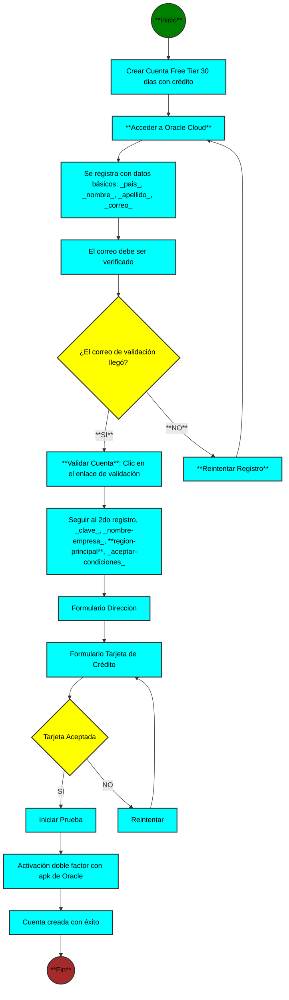
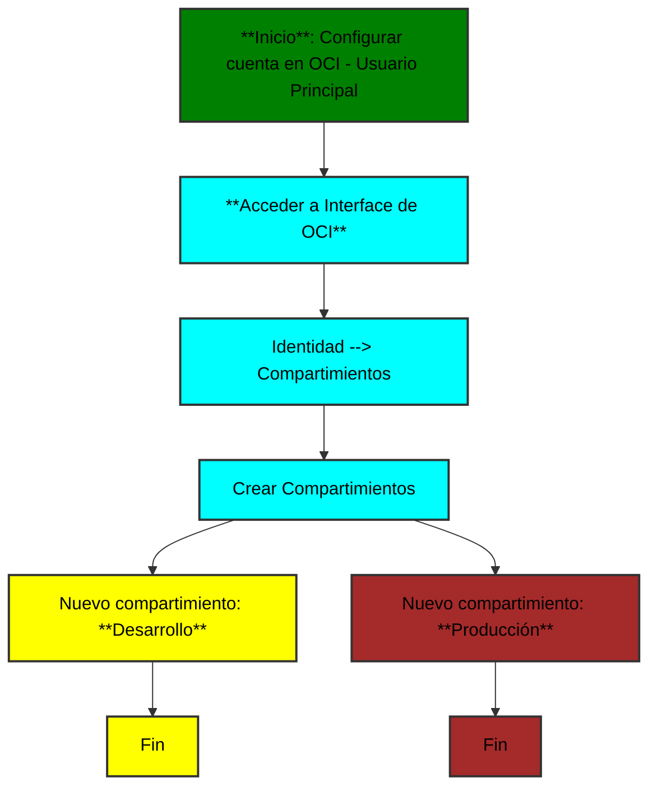
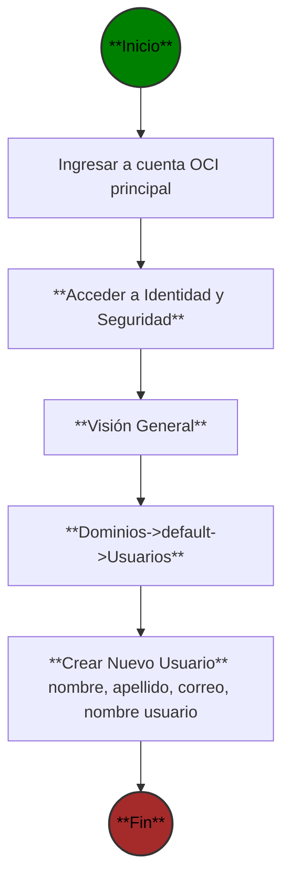
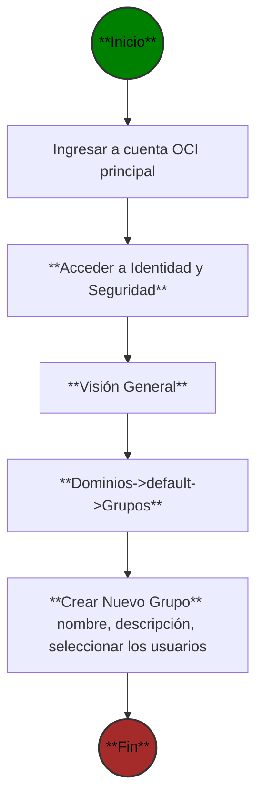
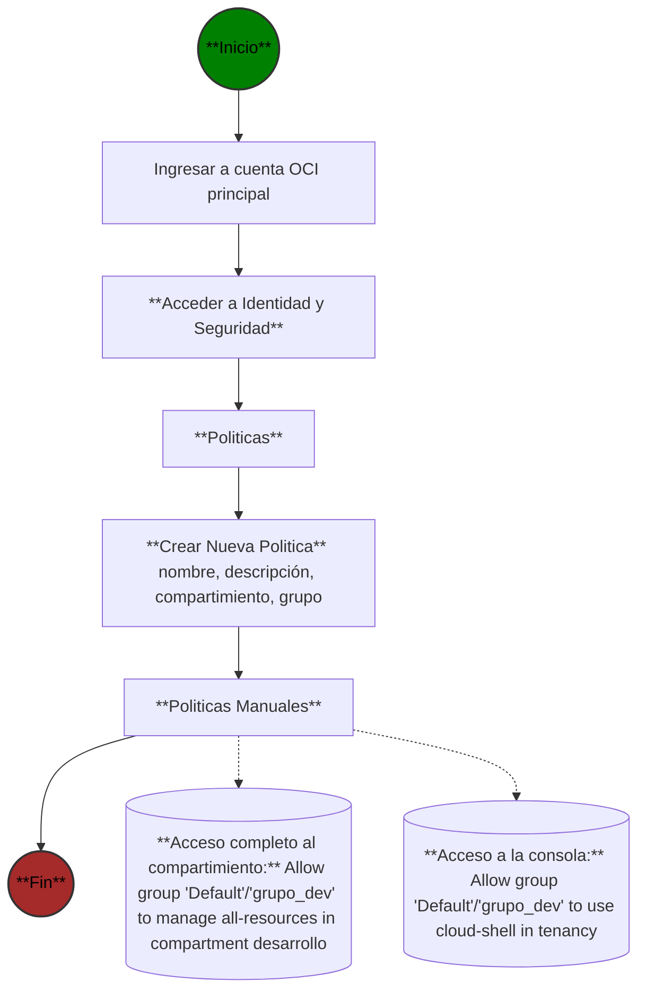

# Diagramas de flujo - Resumen

### Crear Cuenta OCI Free Tier



### Comandos desde la consola o terminal de OCI

| Item | Comando | Uso |
| --------- | --------- | --------- |
|     1      | uname -m          |  muestra el SO, por ejemplo: aarch64, linux         |
|   2        |   oci --version        |  muestra la versión de OCI  ejm: 3.49.2       |
|   3        |  oci iam user list         |           |


Resultado de oci iam user list

```json
{
  "data": [
    {
      "capabilities": {
        "can-use-api-keys": true,
        "can-use-auth-tokens": true,
        "can-use-console-password": true,
        "can-use-customer-secret-keys": true,
        "can-use-db-credentials": true,
        "can-use-o-auth2-client-credentials": true,
        "can-use-smtp-credentials": true
      },
      "compartment-id": "ocid1.tenancy.oc1....."
    }
  ]
}
```

### Definir Compartimientos

- Para la separación logica



### Definir usuario de desarrollo



### Definir Grupo



### Crear políticas para el grupo


3:09

### Crear VCN o red virtual

```mermaid

```