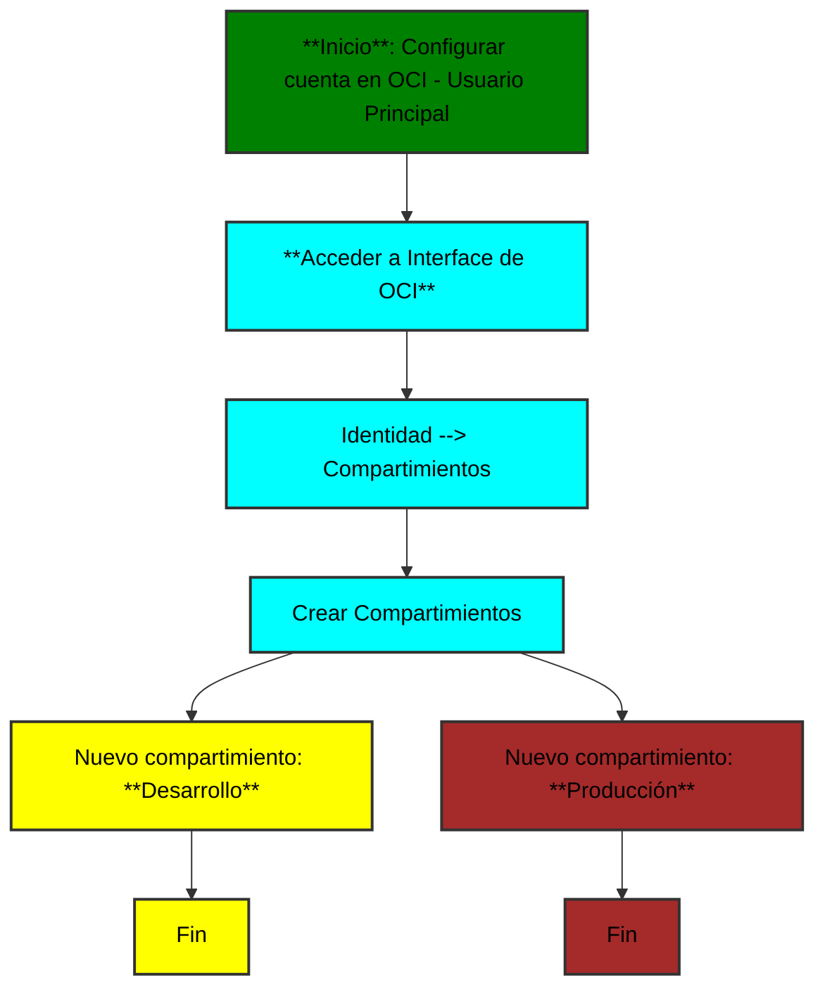

# Diagramas de flujo - Resumen

### Crear Cuenta OCI Free Tier

### Definir Compartimientos

### Definir usuario de desarrollo

### Definir Grupo

### Crear políticas para el grupo

### Crear VCN o red virtual
