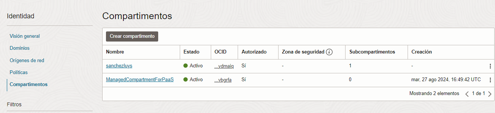
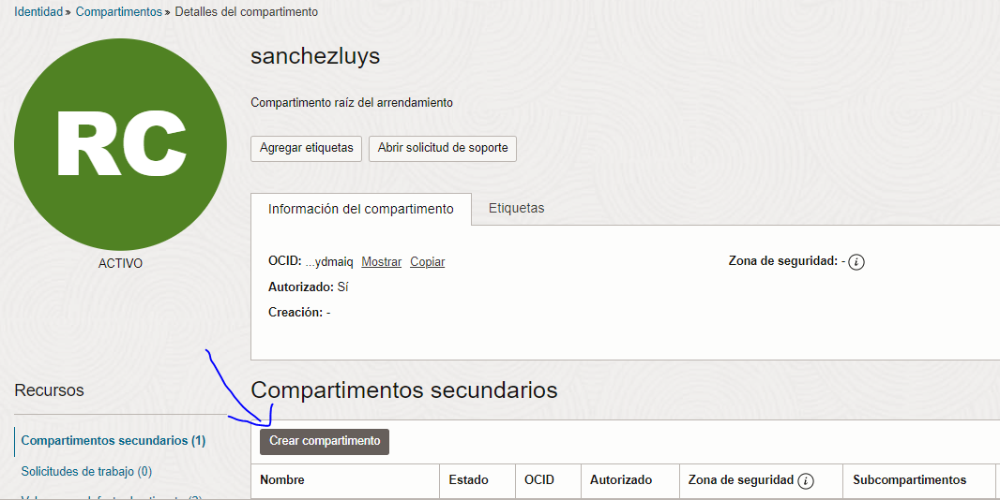
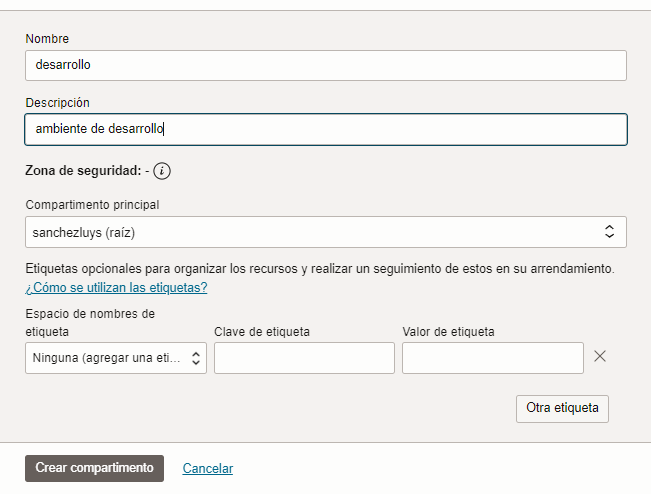
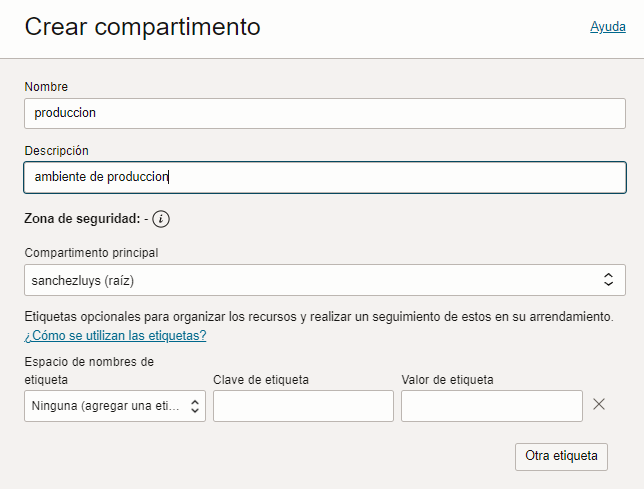
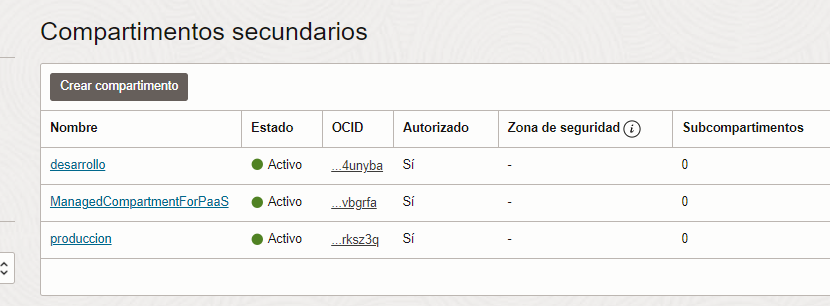

## Arquitectura de OCI

### Visión general del OCI

- Recursos informaticos disponibles

- Almacenamiento

- Red

- Oracle Database

- Bases de datos

** Opciones mas avanzadas disponibles **

- Analisis y a Inteligencia artificial

- Servicios para desarrolladores

- Identidad y seguridad

- Observacion y gestion

- Hibrido, para crear maquinas virtuales por software

- Migracion y Recuperacion ante desastres, tambien se usa para migrar volumenes de datos

- Gestion de facturacion y costos

- Gobernanza y administracion

- Marketplace

- Servicios de OCI classic

La documentacion de OCI esta en: https://docs.oracle.com/es-ww/iaas/Content/GSG/Concepts/baremetalintro.htm
Video: https://youtu.be/JBkT44FSf0o

## Compartimientos

- Opcion ubicada en identidad y seguridad-> compartimientos, es como una carpeta donde se pueden fijar las politicas de acceso a los servicios separados por permisos definidos alli de manera logica
- Alli aparece el compartimiento raiz con que se creo el OCI

- Compartimiento

- Crear 2 compartimientos, uno de desarrollo y otro de produccion

Documentacion completa de compartimientos: https://docs.oracle.com/es-ww/iaas/Content/Identity/compartments/managingcompartments.htm

Video: <iframe width="806" height="400" src="https://www.youtube.com/embed/VJD19vyu6lI" title="IAM Level 100 Part 3: Compartments" frameborder="0" allow="accelerometer; autoplay; clipboard-write; encrypted-media; gyroscope; picture-in-picture; web-share" referrerpolicy="strict-origin-when-cross-origin" allowfullscreen></iframe>